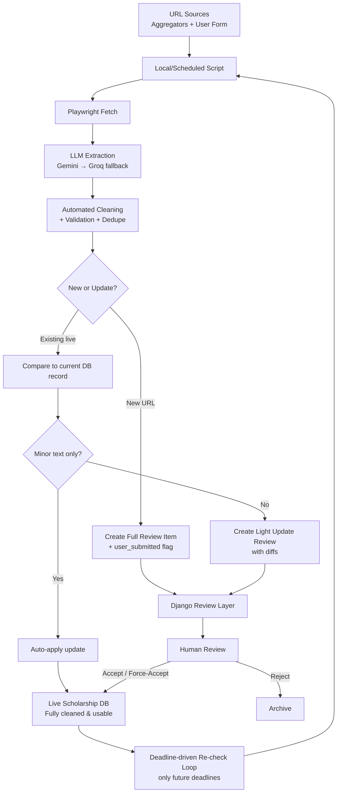

# MeritLink Data Pipeline — Full Workflow

**Goal**: Turn raw scholarship URLs (from aggregators + users) into clean, structured, accurate, genuine data in the live DB that can be trusted for matching, display, tracking, and everything else.

**Core principles** (what we've aligned on):
- Real data first (no heavy reliance on dummy data).
- Human is the final quality gate for new records and meaningful updates.
- Once a record is accepted into the live DB → it is considered "fully cleaned and usable".
- Flexible: you can force-accept even if some fields are thin (source URL is the truth).
- Updates are deadline-driven and conservative (mostly human review for changes).
- Script can run locally (dev) and later as scheduled task (production).

---

## High-Level Architecture

```
┌─────────────────────────────────────────────────────────────────┐
│                        URL SOURCES                              │
├─────────────────────────────────────────────────────────────────┤
│  Aggregators (listing pages)                                    │
│   • scholars4dev.com                                            │
│   • afterschoolafrica.com                                       │
│   • opportunitydesk.org                                         │
│                                                                 │
│  User Submissions                                               │
│   • Public form (URL only) → marked "user_submitted"            │
│     for analytics + trust tracking                              │
└─────────────────────────────────────────────────────────────────┘
                              │
                              ▼
┌─────────────────────────────────────────────────────────────────┐
│                    LOCAL / SCHEDULED SCRIPT                     │
│  (Python • runs locally in dev, later as scheduled task)        │
├─────────────────────────────────────────────────────────────────┤
│  1. Discovery                                                   │
│     - Unified config-driven crawler (Playwright)                │
│     - Pull new URLs from listing pages                          │
│     - Also pull pending user-submitted URLs                     │
│                                                                 │
│  2. Fetch + Extract (per URL)                                   │
│     - Playwright → get full page HTML                           │
│     - Gemini Flash-Lite (primary) → structured JSON             │
│     - Fallback: Groq (Llama 3.3 70B)                            │
│                                                                 │
│  3. Automated Cleaning & Validation                             │
│     - Date normalization & validation                           │
│     - Country / level / field standardization                   │
│     - Amount parsing                                            │
│     - Text cleanup + quality gates                              │
│     - Deduplication (exact URL + fuzzy title match)             │
│                                                                 │
│  4. Classify (using local SQLite state)                         │
│     - New URL?          → New Review Item                       │
│     - Existing live?    → Check if needs update                 │
│                                                                 │
│  5. Push to Django                                              │
│     - Option A (recommended): POST JSON to API endpoint         │
│     - Option B: Write to JSON/CSV file → Django management cmd  │
│     - Mark as user_submitted if applicable                      │
└─────────────────────────────────────────────────────────────────┘
                              │
                              ▼
┌─────────────────────────────────────────────────────────────────┐
│                      DJANGO REVIEW LAYER                        │
├─────────────────────────────────────────────────────────────────┤
│  Two queues (can be one interface with filters):                │
│                                                                 │
│  A. New Scholarship Queue (Full Review)                         │
│     - Human sees full extracted + cleaned data                  │
│     - Can edit ANY field                                        │
│     - Flexible: can force-accept even with missing core fields  │
│     - Accept → moves to Live DB (fully cleaned & usable)        │
│     - Reject → discard or archive                               │
│                                                                 │
│  B. Update Queue (Light Review — conservative)                  │
│     - Only for existing live records                            │
│     - Shows diffs (before vs after re-extraction)               │
│     - Minor text tweaks → can auto-apply (configurable)         │
│     - Most changes → human reviews + edits + approves update    │
│     - Very conservative for now on core fields                  │
└─────────────────────────────────────────────────────────────────┘
                              │
                              ▼
┌─────────────────────────────────────────────────────────────────┐
│                     LIVE USABLE DATA LAYER                      │
│  (Scholarship model in DB — ready for matching, UI, tracker)    │
├─────────────────────────────────────────────────────────────────┤
│  • Clean, structured, normalized fields                         │
│  • source_url preserved (for future re-checks)                  │
│  • Marked with user_submitted flag when applicable              │
│  • last_verified_date updated                                   │
│  • Ready for: hard eligibility gate + weighted scoring          │
│                                                                 │
│  Update loop:                                                   │
│  • Deadline-driven re-checks (only future-deadline records)     │
│  • Script pulls current deadline from live DB via state         │
│  • Re-extract → clean → decide (auto or light review)           │
└─────────────────────────────────────────────────────────────────┘
```

---

## Detailed Step-by-Step Flow

### For Brand New Scholarships (from aggregators or users)

1. **URL Discovery**
   - Script walks aggregator listing pages (configured rules for pagination / link patterns).
   - Also pulls any pending user-submitted URLs (stored with `user_submitted=True` flag).

2. **Fetch**
   - Playwright loads the individual scholarship page (handles JS if needed).

3. **LLM Extraction**
   - HTML (or cleaned version) sent to Gemini.
   - Structured JSON output with all target fields.
   - Fallback to Groq if Gemini fails or rate-limited.

4. **Automated Cleaning & Validation**
   - Dates parsed to proper `date` fields + validated.
   - Countries, study levels, fields normalized (e.g. "Masters" vs "MSc").
   - Amounts turned into numeric + currency where possible.
   - Text deduped / boilerplate removed.
   - Basic quality gates (title + deadline + url present?).
   - Smart deduping against existing records.

5. **New vs Existing Decision** (local SQLite)
   - Exact URL match? → treat as potential update.
   - No match → New.

6. **Push to Review Queue**
   - Preferred: Script calls Django API endpoint (`POST /api/ingest/review-item/`) with the cleaned JSON + `user_submitted` flag.
   - Alternative (your idea): Script writes JSON/CSV files. A Django management command (`python manage.py import_review_items path/to/file.json`) reads them and creates ReviewItem records.
   - ReviewItem record created with `status=pending`, `is_user_submitted` flag, `source="scraper"` or `"user"`.

7. **Human Full Review**
   - In Django admin (or custom review UI):
     - See all extracted fields.
     - Edit any field you want.
     - Can force-accept even if some core fields are still empty.
   - Accept → creates/updates the live `Scholarship` record (marked clean & usable).
   - Reject → archived with reason.

8. **Live DB**
   - Record now in the main `Scholarship` table.
   - All core fields + whatever else you filled.
   - `source_url` stored.
   - `is_user_submitted` flag recorded for analytics.
   - `last_verified_date = now()`

### For Updates to Existing Live Scholarships

1. **Re-check Decision** (deadline-driven)
   - Script looks at live records where `application_deadline > today`.
   - Uses local SQLite to track `last_checked_date` and current deadline.
   - Only re-visits those due for a check (or all open ones on a run).

2. **Re-fetch + Re-extract + Clean**
   - Same Playwright + LLM + cleaning steps as above.
   - Compares against the current live record.

3. **Change Classification**
   - Only minor text differences (e.g. small description tweak) → **auto-apply** (after cleaning).
   - Anything else (deadline change, eligibility, amount, big description shift, status, etc.) → **Light Update Review**.

4. **Light Update Review**
   - Review item created showing clear diffs.
   - You can:
     - Approve the update (with optional edits).
     - Reject the update (keep old data).
   - Very conservative: most non-trivial changes go through you.

5. **Apply Update**
   - Approved changes written to the live `Scholarship` record.
   - `last_verified_date` updated.
   - (Optional) keep a lightweight change history if desired later.

6. **Closed / Expired Records**
   - Once deadline passes, we largely stop re-checking.
   - Occasional checks can update status (e.g. "results announced").

---

## Suggested Workflow for Script ↔ Django Communication

Your idea (files + management command) is actually **very good**, especially early on:

**Recommended hybrid approach:**

- **During development (local only)**:
  - Script can write structured JSON files to a folder (`exports/review_items_2026-06-29.json`).
  - You run `python manage.py process_ingest_batch path/to/file.json`.
  - Easy to inspect the files, debug, no need for server running.

- **Later (when live + scheduled task)**:
  - Add a simple authenticated API endpoint on Django:
    ```json
    POST /api/ingest/submit/
    {
      "items": [ {cleaned scholarship data...} ],
      "batch_id": "...",
      "submitted_by": "script"
    }
    ```
  - Script can still fall back to file export if the API is down.

- **User submissions**:
  - Public form saves a `PendingUrl` model (url + user_submitted=True + submitted_at).
  - Script, on next run, fetches pending user URLs, processes them, marks them consumed.

This gives you flexibility and works whether the script is local or on a server.

---

## Suggested Starter Automated Cleaning Rules

Since you want to see something concrete now (and will refine with real data):

**Date handling**
- Parse "15 June 2026", "June 15th", "15/06/2026", etc. → proper date.
- If parsed deadline < today → flag as "already closed" (but still allow human to accept if it's a recurring thing).

**Eligibility normalization**
- Study levels: map "postgraduate", "MSc", "Master's" → "Masters"
- Countries: normalize spelling, handle "UK" / "United Kingdom", "USA" / "United States".
- Fields: "Computer Science", "CS", "Computing" → canonical list or keep as free text with tags.

**Amounts**
- "Full tuition + £15,000 stipend" → structured: `{"type": "full_tuition_plus_stipend", "stipend_gbp": 15000}`
- Ranges: "up to $50,000" → `max_amount`.

**Text cleanup**
- Strip common boilerplate ("Apply now!", "Click here").
- Generate `short_summary` (first 2-3 sentences or LLM-assisted) if missing.
- Remove excessive newlines / HTML remnants.

**Quality gates (before review)**
- Must have: title + source_url (hard fail otherwise).
- Warn if no deadline or no study level after extraction.
- Dedupe: same URL or very similar title + provider.

We can make these rules configurable (Python functions or simple rules file) so they improve as you see real extractions.

---

## Visual Summary (Mermaid — copy into Mermaid live editor if needed)



---

This should give you a clear mental model of how data flows from messy web pages all the way to trusted records in the DB.

Would you like me to:
- Adjust anything in this diagram or the workflow?
- Go deeper on any section (e.g. exact API payload shape, ReviewItem model fields, how to track user submissions stats)?
- Start sketching the actual Django models or the review admin interface concepts?
- Focus on something else?

Just tell me what to refine next.

---

## Django Project Structure (Best Practice)

Following Django best practices, the data pipeline is isolated in its own app while the live canonical data lives in a focused domain app.

### Recommended App Layout

```
MeritLink/
├── MeritLink/                 # Project config
├── core/                      # Shared utilities, middleware
├── ingestion/                 # Data pipeline (acquisition + review)
│   ├── management/commands/
│   │   ├── process_ingest_batch.py
│   │   └── recheck_open_scholarships.py
│   ├── services/
│   │   ├── cleaning.py        # Automated cleaning rules
│   │   └── deduplication.py
│   ├── models.py              # ReviewItem, PendingUrl
│   ├── admin.py               # Full + Light review interfaces
│   ├── tasks.py               # Celery (future)
│   └── ...
├── scholarships/              # Live usable domain model
│   ├── models.py              # Scholarship (core entity)
│   ├── managers.py
│   ├── selectors.py           # Reusable queries (great for matching)
│   ├── admin.py
│   └── ...
├── ... (future: accounts, profiles, matching, tracker, etc.)
```

### App Responsibilities

**`scholarships` app**
- Owns the `Scholarship` model (the final clean data).
- Used by all future user-facing features.
- Contains business logic that applies to live records.

**`ingestion` app**
- Owns the pipeline concerns: review queue, user submissions, cleaning logic.
- Depends on `scholarships` (imports `Scholarship` to create records after approval).
- Contains management commands that the external script talks to.
- Will later contain Celery tasks.

This separation lets you perfect the data pipeline without polluting the domain model that everything else will depend on.

### How the External Script Talks to Django

1. **Dev mode (local)**: Script writes JSON → `python manage.py process_ingest_batch exports/batch.json`
2. **Production scheduled**: Same management command or lightweight API endpoint inside the `ingestion` app.

The management command lives in `ingestion/management/commands/`.

